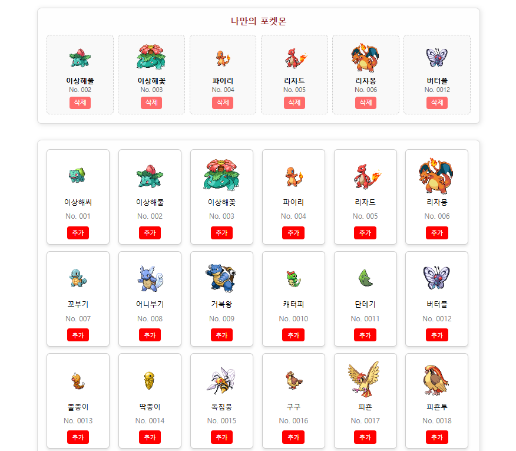

# 🐾 포켓몬 도감 (Pokemon Dex)

- 배포주소 : https://poketmon-omega.vercel.app/

## 📌 프로젝트 소개

포켓몬을 수집하고 관리할 수 있는 웹 애플리케이션입니다. 사용자는 포켓몬 리스트에서 원하는 포켓몬을 선택하여 나만의 포켓몬 팀을 구성할 수 있으며, 포켓몬 상세 페이지에서 추가/삭제할 수 있습니다.

## 🚀 주요 기능

- **포켓몬 리스트 조회**: `MOCK_DATA`를 활용하여 포켓몬 목록을 불러오고, `PokemonCard` 컴포넌트로 렌더링합니다.
- **포켓몬 추가/삭제**: 최대 6마리까지 포켓몬을 추가할 수 있으며, 선택된 포켓몬을 삭제할 수 있습니다.
- **포켓몬 상세 정보 보기**: 포켓몬 카드를 클릭하면 해당 포켓몬의 상세 정보를 볼 수 있습니다.
- **상태 관리**: Redux Toolkit을 사용하여 포켓몬 리스트와 선택된 포켓몬 데이터를 관리합니다.
- **로컬 스토리지 저장**: 선택한 포켓몬 데이터를 로컬 스토리지에 저장하여 새로고침 후에도 유지됩니다.

## 📁 폴더 구조

```
📂 src
├── 📂 components
│   ├── Dashboard.jsx
│   ├── PokemonCard.jsx
│   ├── PokemonList.jsx
│
├── 📂 pages
│   ├── Dex.jsx
│   ├── PokemonDetail.jsx
│   ├── Home.jsx
│
├── 📂 shared
│   ├── Router.jsx
│
├── 📂 context
│   ├── PokemonContext.jsx (RTK 적용 후 사용 안함)
│
├── 📂 redux
│   ├── 📂 config
│   │    ├── configStore.js  (Redux Store 설정)
│   ├── 📂 slices
│   │    ├── pokemonSlice.js (Pokemon 상태 관리)
│
├── 📂 data
│   ├── pokemonData.js (포켓몬 더미 데이터)
│
├── 📂 css
│   ├── GlobalStyle.js
│   ├── reset.css
│
├── App.jsx
```

## 🛠️ 사용 기술

- **프레임워크 & 라이브러리**: React, Vite
- **스타일링**: styled-components
- **상태 관리**: Redux Toolkit
- **라우팅**: react-router-dom
